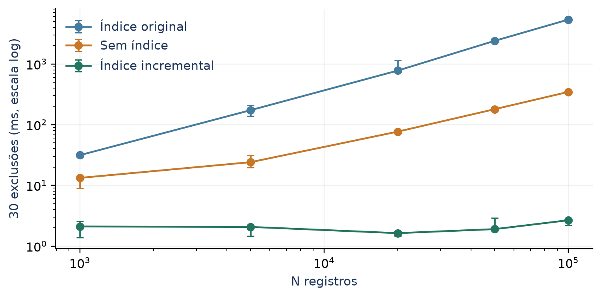
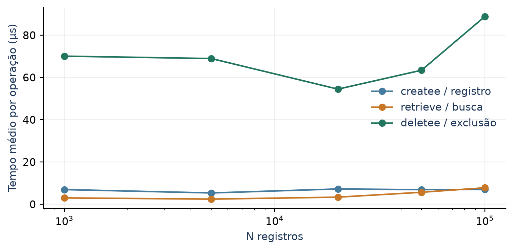
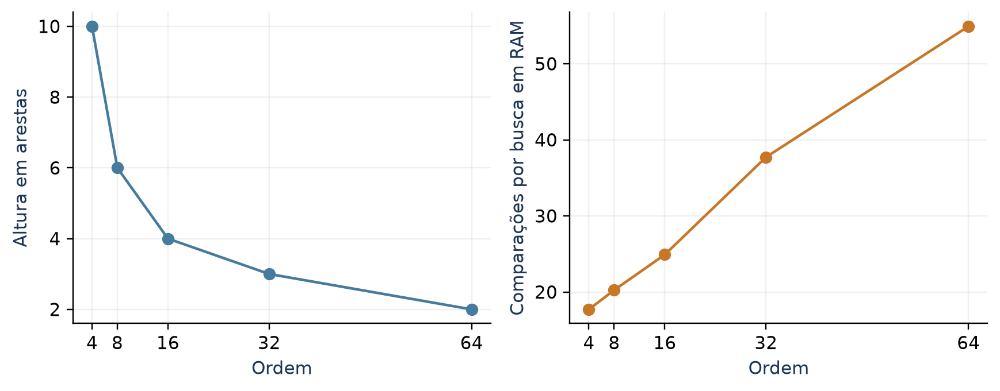
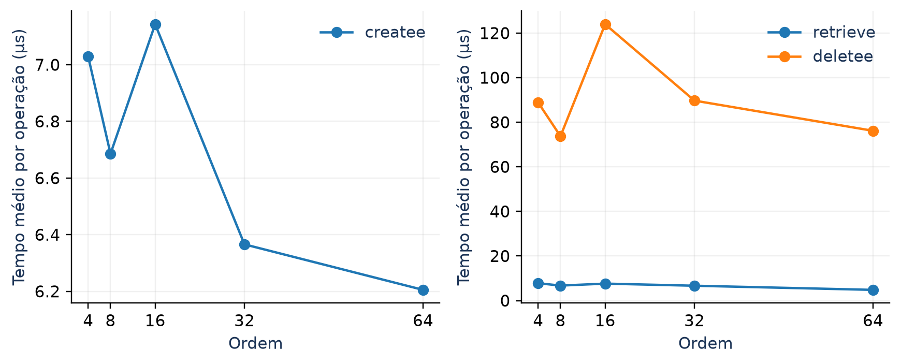
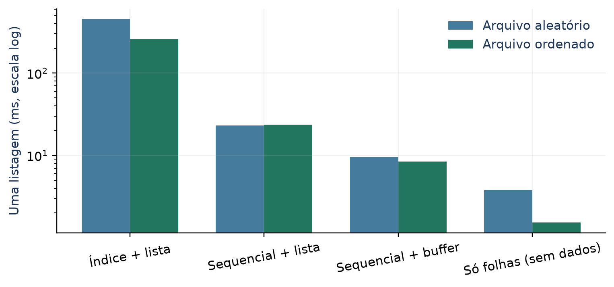

# Projeto Prático 2 - Árvores Multicaminhos

**UTFPR - Câmpus Medianeira | Ciência da Computação | Árvores e Grafos | 2026.2**

**Equipe:** Erik Mazzuco, Letícia Moro, Leonardo Herrero

**Prazo do enunciado:** 04/10/2026

**Repositório do projeto:** [https://github.com/leohsm/AeG-Projeto-Arvores-Multicaminhos](https://github.com/leohsm/AeG-Projeto-Arvores-Multicaminhos)

## 1. Objetivos e metodologia

O projeto avalia os itens 4, 5 e 6 do enunciado: eliminar a reconstrução do índice em cada exclusão, medir o efeito de ORDEM_INDICE e explicar por que percorrer as folhas da B+ não torna a listagem completa automaticamente mais rápida. A implementação parte do FrameworkPersistencia_com_indice.zip fornecido pela disciplina; o repositório do Projeto 1 foi usado para os dados da equipe e a organização do documento.

**Resultado principal:** em N = 100.000, as 30 exclusões com ordem 4 passaram de 5.376,468 ms para 2,665 ms, uma aceleração de 2.017,5 vezes nesta máquina. A árvore foi mantida e nenhuma exclusão criou novos nós ou executou splits.

| Operação | Trabalho cronometrado |

| --- | --- |

| createe | N inserções em ordem embaralhada |

| retrieve / update | 200 buscas / 200 atualizações de chaves existentes |

| deletee | 30 exclusões de chaves distintas |

| queryAll / queryBy | Média de 5 listagens / filtros; inclui liberação da saída |

N = 1.000, 5.000, 20.000, 50.000 e 100.000. Ordens = 4, 8, 16, 32 e 64. Foram executadas 3 rodadas, com sementes 12345, 12346, 12347. Cada combinação começa com arquivos novos. O baseline é a exclusão original na ordem 4; a solução usa a exclusão incremental nas cinco ordens. Os dois modos recebem as mesmas chaves dentro de cada rodada.

As tabelas mostram medianas das três rodadas. Quando indicado, mínimo e máximo representam variação entre sementes e execuções, sem interpretação de intervalo de confiança. Tempos absolutos do relatório original da disciplina foram medidos em outro ambiente e não foram misturados aos novos resultados.

### Ambiente e controle experimental

Windows-11-10.0.26200-SP0; Intel64 Family 6 Model 140 Stepping 1, GenuineIntel; 8 CPUs lógicas. Compilador Zig 0.16.0 (zig cc/Clang), opções -O2 -std=c11. Relógio monotônico QueryPerformanceCounter. Registro Pessoa de 40 bytes; arquivos locais na unidade C:. As execuções foram sequenciais.

O cache do sistema operacional permanece ativo. Não há fsync nem medição de durabilidade transacional. Abrir/fechar e serializar o arquivo .idx ficam fora das medições de CRUD. A instrumentação é igual no baseline e na solução; altura e nós são calculados fora do intervalo de createe. O bench.c mantém a ordem com índice antes de sem índice, uma limitação metodológica.

## 2. Implementação da exclusão incremental

A exclusão original lê todos os registros, materializa os sobreviventes, trunca e regrava o arquivo e recria a B+ inserindo todos novamente. Para ordem fixa, isso soma O(N log N) por exclusão, além de O(N) de I/O e memória auxiliar. O custo elevado vem dessa estratégia, não da remoção balanceada da biblioteca.

Foi escolhida a solução **swap com o último registro**. Os registros possuem tamanho fixo e chaves únicas, como na carga fornecida. A rotina localiza o offset pela B+, lê o último registro, sobrescreve a posição removida, sincroniza o buffer de stdio e trunca exatamente um registro. Em seguida, corrige o offset do registro movido e chama removerArv para a chave excluída.

| Offset | Antes | Após remover B |

| --- | --- | --- |

| 0 | A | A |

| 40 | B | D (movido de 120) |

| 80 | C | C |

| 120 | D | Fim do arquivo: 120 bytes |

Nesse exemplo, as entradas A → 0 e C → 80 permanecem válidas. Somente D passa de 120 para 40, e B desaparece do índice. Quando o alvo já é o último registro, não há cópia nem atualização de sobrevivente. Uma chave inexistente não modifica arquivo ou índice.

### Detalhes que garantem a consistência

buscarArv devolve uma **cópia** do valor, portanto modificar esse retorno não atualizaria o índice. A rotina encontra a folha do registro movido e altera seu valor long diretamente. A atualização ocorre antes de removerArv, pois empréstimos e fusões podem reorganizar as folhas. Nenhuma inserção é necessária: inserirArv não implementa substituição de uma chave existente e poderia criar duplicatas.

O arquivo é truncado com _chsize_s no Windows e ftruncate em POSIX, após fflush. As leituras, alinhamento dos offsets e correspondência do último registro são verificados. A assinatura pública void é preservada; errno informa sucesso, ausência ou falha. Há tentativa de restaurar o registro anterior se a escrita/truncamento falhar, sem garantia transacional para falhas repetidas ou interrupções do processo.

### Complexidade e consequências

Para ordem m e altura h, as buscas lineares nos nós custam O(mh), com h = O(log_m N). Em ordem fixa, a exclusão é O(log N) no índice e O(1) de volume de dados movimentado: até duas leituras e uma escrita de registro, mais truncamento. A memória auxiliar é O(tamanhoRegistro), independente de N. A ordem física dos registros muda; queryAll continua retornando ordem de chave.

## 3. Resultados de deletee (item 4)

| N | Original com índice
(ms) | Incremental
(ms) | Sem índice
(ms) | Aceleração
original/incr. |

| --- | --- | --- | --- | --- |

| 1.000 | 31,468 | 2,102 | 13,274 | 15,0x |

| 5.000 | 173,237 | 2,068 | 24,109 | 83,8x |

| 20.000 | 776,881 | 1,634 | 76,701 | 475,4x |

| 50.000 | 2.405,790 | 1,903 | 179,972 | 1.264,5x |

| 100.000 | 5.376,468 | 2,665 | 346,010 | 2.017,5x |

Figura 1. Medianas de 30 exclusões por rodada; barras mostram mínimo e máximo. Ordem 4, eixos logarítmicos.

Aumentar N de 1.000 para 100.000 multiplicou o tempo original por 170,9, enquanto o incremental variou por um fator de 1,27. Essa diferença é compatível com retirar a varredura e a reconstrução completas. O tempo de truncamento e I/O introduz custo fixo e variação; a curva medida não constitui uma prova de complexidade assintótica.

A versão sem índice ainda varre e regrava todo o arquivo. A solução incremental atua diretamente sobre a posição encontrada pela B+. A comparação utiliza o baseline executado nesta máquina, mantendo os números históricos de 7,85 s e 0,18 s apenas como motivação do enunciado.

## 4. Comparação por operação e validação

Figura 2. Tempos normalizados da solução na ordem 4: createe/N, retrieve/200 e deletee/30, em microssegundos.

O número de inserções varia com N, enquanto as buscas e exclusões usam lotes fixos. Comparar diretamente os tempos totais de createe e deletee produziria uma conclusão incorreta. A normalização mostra o custo médio de cada operação: a exclusão mantém comportamento de operação pontual, com constantes de I/O maiores que uma busca simples.

| N = 100.000 | Original com índice (ms) | Solução, ordem 4 (ms) | Sem índice original (ms) |

| --- | --- | --- | --- |

| createe | 800,428 | 702,882 | 498,954 |

| retrieve | 1,463 | 1,561 | 839,028 |

| update | 2,407 | 2,282 | 912,893 |

| deletee | 5.376,468 | 2,665 | 346,010 |

| queryAll | 483,988 | 473,380 | 7,887 |

| queryBy | 484,704 | 466,740 | 8,097 |

### Verificação funcional

Os testes em C validaram as cinco ordens contra um modelo de referência: arquivo vazio, chave ausente, primeiro/último/único registro, 3.000 inserções e remoção de todos os registros em ordem aleatória, 5.000 operações mistas, alteração de chave, reabertura e reconstrução quando .idx está ausente. Os checks conferem conteúdo completo, tamanho do arquivo, offsets, unicidade, ordenação, ocupação mínima, roteamento dos separadores, pais e profundidade uniforme das folhas.

Cada deletee é também verificado quanto à permanência do descritor da árvore e à ausência de novos nós e splits. O benchmark interrompe a execução se a contagem N - 30 divergir. Todos os testes e rodadas concluíram com sucesso. As quantidades de checks são verificações individuais de invariantes, não casos de teste independentes.

## 5. Ordem, altura e splits (item 5)

ORDEM_INDICE passou a aceitar sobrescrita pelo compilador, com valor padrão 4. A instrumentação conta cada criarNoh, cada divisão de folha e de nó interno, além de empréstimos e fusões. A altura e a quantidade de nós vivos são calculadas por percurso estrutural fora do tempo medido. Altura em arestas: uma árvore formada por uma folha tem altura zero.

| Ordem | Altura | Nós vivos | Folhas | Splits folha | Splits internos |

| --- | --- | --- | --- | --- | --- |

| 4 | 10 | 64.854 | 42.851 | 42.850 | 21.993 |

| 8 | 6 | 23.895 | 19.744 | 19.743 | 4.141 |

| 16 | 4 | 10.351 | 9.430 | 9.429 | 911 |

| 32 | 3 | 4.792 | 4.584 | 4.583 | 207 |

| 64 | 2 | 2.336 | 2.284 | 2.283 | 49 |

Tabela: medianas da estrutura imediatamente após inserir 100.000 registros embaralhados. Splits contam eventos de divisão; criar uma raiz também aumenta nós criados, mas não é um split adicional. Nós criados são cumulativos, enquanto nós vivos refletem a estrutura atual. A ocupação mínima didática do framework, (ordem - 1)/2, foi preservada para folhas e nós internos.

Figura 3. Maior ordem reduz a altura; a busca linear em vetores maiores pode aumentar as comparações por consulta.

encontrarFolha percorre os separadores linearmente e buscarArv também varre a folha. Reduzir a altura não elimina esse trabalho. Para separar CPU do custo de acessar o arquivo, o experimento complementar executa 100.000 buscarArv somente no índice em memória e conta todas as chamadas de comparação, incluindo nós internos e folhas.

## 6. Ordem e desempenho das operações

| Ordem | createe
N inserções (ms) | retrieve
200 buscas (ms) | deletee
30 exclusões (ms) | 100 mil buscas
em RAM (ms) | Comparações
por busca |

| --- | --- | --- | --- | --- | --- |

| 4 | 702,882 | 1,561 | 2,665 | 83,218 | 17,71 |

| 8 | 668,572 | 1,344 | 2,212 | 42,713 | 20,25 |

| 16 | 714,290 | 1,522 | 3,718 | 29,347 | 24,91 |

| 32 | 636,584 | 1,332 | 2,691 | 23,863 | 37,73 |

| 64 | 620,518 | 0,960 | 2,285 | 26,314 | 54,92 |

Figura 4. Medianas por operação em N = 100.000; a altura menor não garante a menor latência em todos os CRUDs.

A menor mediana de busca apenas em RAM ocorreu na ordem 32, nesta carga. A ordem 4 tem mais níveis, mais nós e mais alocações. Nas ordens maiores, cada nó concentra mais chaves, reduzindo níveis e splits, mas aumentando varreduras e deslocamentos de ponteiros nas inserções. As buscas com I/O podem esconder diferenças de CPU percebidas no experimento em RAM.

A escolha depende da carga: altura, uso de memória, frequência de escrita, acesso ao arquivo e comparação das chaves. As ordens 4 a 64 foram medidas com três sementes, sem assumir que a maior é sempre melhor. Mais repetições e cargas com outras chaves seriam necessárias para estabelecer uma configuração universal. Uma evolução possível é busca binária nos vetores dos nós, avaliando novamente o custo de comparação e localidade.

### Efeito da exclusão na estrutura

| Ordem | Empréstimos
30 deletes | Fusões
30 deletes | Splits
30 deletes | Nós criados
30 deletes |

| --- | --- | --- | --- | --- |

| 4 | 0 | 0 | 0 | 0 |

| 8 | 0 | 0 | 0 | 0 |

| 16 | 0 | 0 | 0 | 0 |

| 32 | 0 | 0 | 0 | 0 |

| 64 | 0 | 0 | 0 | 0 |

As 30 exclusões representam uma pequena fração de N. Os testes que removem todos os 3.000 registros também exercitam fusões, empréstimos e redução da raiz. A ausência de splits e novos nós confirma que deletee não reconstrói o índice.

## 7. Análise crítica de queryAll (item 6)

A B+ contém uma **lista encadeada de folhas com chaves e offsets**; os registros completos permanecem no arquivo. percorrerArv desce uma vez à primeira folha e segue proximo, com custo O(h + N). O visitante de queryAll executa fseek + fread para cada offset e aloca um registro e um nó da lista. Um arquivo inserido em ordem aleatória exige leituras em ordem de chave que não correspondem à ordem física.

A varredura sem índice usa rewind e fread consecutivos. Ambas as versões precisam retornar N registros: o índice não reduz a quantidade de dados de uma listagem completa. O ganho da lista de folhas é evitar N buscas desde a raiz e entregar as chaves ordenadas; ele não garante acesso sequencial ao arquivo nem remove o custo de materialização.

| N | Original com índice (ms) | Incremental com índice (ms) | Sem índice original (ms) |

| --- | --- | --- | --- |

| 1.000 | 2,208 | 2,014 | 0,075 |

| 5.000 | 13,044 | 14,045 | 0,495 |

| 20.000 | 54,737 | 54,897 | 1,414 |

| 50.000 | 155,876 | 159,782 | 3,752 |

| 100.000 | 483,988 | 473,380 | 7,887 |

### Dois fatores de confusão do benchmark fornecido

Primeiro, o modo com índice devolve pDLista com duas alocações por registro; o sem índice devolve um buffer contínuo que cresce com realloc. Parte da diferença pertence à representação da saída. Segundo, a versão indexada entrega ordem de chave, enquanto a versão sem índice mantém a ordem física de inserção. Não oferecem exatamente a mesma ordenação.

Por isso foi adicionado um controle que usa o mesmo arquivo e separa quatro alternativas: índice com lista; varredura sequencial com lista; varredura sequencial com buffer; percurso das folhas sem ler registros. As três primeiras incluem materialização e liberação. A quarta serve apenas para medir o percurso e não é uma implementação equivalente de queryAll. Cada alternativa é aquecida e medida cinco vezes, nas três sementes.

queryAll foi mantida ordenada. A função adicional queryAllSequencial oferece a listagem em ordem física com a mesma representação pDLista. Ela é adequada quando o chamador não exige ordenação. Para exigir ordem de chave após a leitura sequencial, seria necessário ordenar os registros, acrescentando trabalho que este controle não mede.

## 8. Experimento controlado de listagem

| Alternativa
N = 100.000, ordem 4 | Arquivo aleatório (ms) | Arquivo ordenado (ms) |

| --- | --- | --- |

| Índice + lista | 456,345 | 258,608 |

| Sequencial + lista | 23,210 | 23,597 |

| Sequencial + buffer | 9,573 | 8,481 |

| Somente percurso de folhas | 3,821 | 1,531 |

Figura 5. Mesmo arquivo e cache aquecido. “Só folhas” não retorna os registros e serve como controle do custo de percurso.

Com o arquivo aleatório, índice + lista ficou 19,7 vezes mais lento que sequencial + lista, mantendo a mesma representação. A comparação entre as duas leituras sequenciais evidencia o custo adicional da lista e das alocações. O arquivo ordenado testa a localidade: os offsets crescem em ordem de chave, mas continuam existindo N fseek/fread e a materialização de N registros.

Os controles sustentam a explicação pela combinação de padrão de acesso e construção da saída, não por uma falha no encadeamento das folhas. Como as leituras estão em cache, os tempos não representam diretamente latência de mídia física; chamadas de stdio, buffering, alocação e efeitos de cache de CPU também participam do custo observado.

A exclusão por swap pode desfazer a ordenação física prévia. Portanto, mesmo um arquivo inicialmente ordenado pode perder localidade com exclusões sucessivas. Para consultas por faixa, a B+ pode visitar somente as chaves do intervalo; para queryAll, que precisa de todas, a varredura sequencial tende a ser adequada quando não há exigência de ordenação. O filtro por idade de queryBy também exige os registros completos e não é acelerado por um índice apenas de CPF.

## 9. Conclusões, limites e reprodução

**Item 4:** a troca com o último registro removeu a reconstrução do índice, manteve os offsets dos demais registros e obteve aceleração de 2.017,5 vezes para 30 exclusões em N = 100.000 e ordem 4. O custo algorítmico passa a ser de operação pontual na árvore, com I/O de volume constante. A curva medida é compatível com essa mudança e deve ser interpretada junto às constantes de I/O.

**Item 5:** a ordem altera altura, quantidade de nós, splits e custo de comparação. Aumentar a ordem de 4 para 64 reduziu a altura mediana de 10 para 2. A menor mediana de busca em RAM ocorreu na ordem 32; reduzir altura isoladamente não determina o melhor desempenho de todos os CRUDs.

**Item 6:** as folhas armazenam offsets, não cópias completas dos registros. O percurso eficiente da B+ não evita a leitura de todos os dados e pode produzir acesso disperso. A representação da saída também penaliza a comparação original. Os controles isolam esses fatores, preservando a consulta ordenada e oferecendo uma alternativa sequencial explícita.

### Limites da solução e das medições

A solução pressupõe registros de tamanho fixo e chaves únicas. A biblioteca fornecida não bloqueia duplicatas automaticamente. O formato binário original depende da struct e de sizeof(long), portanto arquivos .idx não são portáveis entre ABIs. Não há controle de concorrência, journal ou recuperação de falhas: o índice é mantido em memória e salvo ao fechar. Fechar continua O(N), e carregarArvore reinserindo os pares continua O(N log N); esses custos não foram transferidos para a métrica de deletee nem incluídos nela.

Três sementes, uma máquina, ordem fixa dos modos, cache ativo e registros de 40 bytes limitam a generalização. O persistAll original não mantém sozinho o índice consistente após uma regravação arbitrária; esta entrega usa-o apenas no baseline e não o emprega na exclusão corrigida. A otimização não fornece garantias transacionais de produção.

### Reprodução e arquivos entregues

1. Compilar e testar: python scripts/executar.py --compiler CAMINHO_DO_COMPILADOR --somente-testes. 2. Reexecutar a avaliação: python scripts/executar.py --compiler CAMINHO_DO_COMPILADOR --repeticoes 3. 3. Gerar tabelas, gráficos e relatório: python scripts/gerar_relatorio.py.

O compilador pode ser gcc/clang ou zig.exe. No Linux/macOS, utilize GCC ou Clang e execute o script em Python 3. Dependências do relatório: matplotlib, reportlab e Pillow. Os caminhos dos executáveis são gerados pelo script. Consulte README.md para os comandos completos e a descrição dos CSVs.

| Local | Conteúdo |

| --- | --- |

| solucao/source/ | Framework com deletee incremental e queryAllSequencial |

| baseline/source/ | Algoritmos originais com o mesmo relógio e instrumentação |

| tests/ e benchmarks/ | Validação em C e experimento controlado |

| results/ | CSVs brutos/consolidados, ambiente e logs |

| plots/ e output/pdf/ | Gráficos e relatório PDF/Markdown |

## 10. Referências e rastreabilidade

[1] UTFPR - DACOM-MD. Projeto Prático 2 - Árvores Multi-caminhos. Período 2026.2. Documento fornecido: 21_Projeto_Arvores_Multicaminhos-1.pdf. Requisitos dos itens 4, 5, 6 e 8; prazo 04/10/2026.

[2] UTFPR. Framework de Persistência com Índice (Árvore B+). Pacote fornecido pelo usuário: FrameworkPersistencia_com_indice.zip. Recurso indicado no enunciado: <link href="https://moodle.utfpr.edu.br/mod/resource/view.php?id=2178366" color="#457B9D">moodle.utfpr.edu.br/mod/resource/view.php?id=2178366</link>. A base efetivamente usada foi o ZIP local; não foi necessário autenticar no Moodle.

[3] Relatório de Desempenho - Índice em Árvore B+ na Biblioteca de Persistência. Relatorio_Desempenho_IndiceBMais.pdf, incluído no framework. Utilizado para a análise crítica e para identificar as limitações da comparação inicial. Seus tempos históricos não substituem as medições desta entrega.

[4] HERRERO, Leonardo; MAZZUCO, Erik; MORO, Letícia. AeG-Projeto-Arvores-Balanceadas. README.md e modelo de relatório. <link href="https://github.com/leohsm/AeG-Projeto-Arvores-Balanceadas" color="#457B9D">github.com/leohsm/AeG-Projeto-Arvores-Balanceadas</link>. Commit consultado: bba1ef7f04c75574ad09a97a458dd82c35f515f7. Os nomes e a afiliação foram obtidos dessa referência; o código do Projeto 1 não foi utilizado como biblioteca B+.

[5] Zig Software Foundation. Compilador Zig 0.16.0. Distribuição oficial: <link href="https://ziglang.org/download/" color="#457B9D">ziglang.org/download/</link>. Arquivo baixado com verificação de SHA-256 conforme tools/zig-download.json.

### Evidências verificáveis

Os CSVs preservam versão, ordem, N, modo, repetição e semente. results/resumo.csv apresenta mediana, mínimo e máximo. results/metricas.csv separa splits de folhas e internos e confirma novos nós/splits durante deletee. results/estudo.csv registra os controles de listagem e as comparações de busca em RAM. Os logs de execução e compilação acompanham a entrega.

O diretório original/ preserva o material recebido; baseline/ e solucao/ são cópias de trabalho. O arquivo alteracoes.patch explicita as alterações entre original e solução. manifest.json registra hashes SHA-256 dos arquivos-fonte originais e do ZIP, permitindo confirmar a origem do trabalho.

### Uso de ferramentas de IA

Foi utilizado apoio de IA na implementação, na elaboração dos testes, na execução da avaliação e na organização do relatório, conforme permitido pelo item 7 do enunciado. Os resultados apresentados foram produzidos pela execução dos programas e não por estimativa textual. Todos os testes funcionais e verificações estruturais concluíram com sucesso.

OK ordem=4 checks=2513779 (CRUD, offsets, balanceamento, fusoes, reabertura)

OK ordem=8 checks=2163339 (CRUD, offsets, balanceamento, fusoes, reabertura)

OK ordem=16 checks=2043457 (CRUD, offsets, balanceamento, fusoes, reabertura)

OK ordem=32 checks=1995682 (CRUD, offsets, balanceamento, fusoes, reabertura)

OK ordem=64 checks=1974580 (CRUD, offsets, balanceamento, fusoes, reabertura)